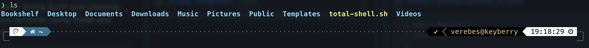
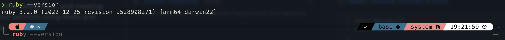
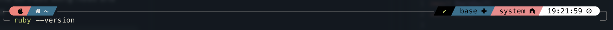

# Total Shell

This simple script allows you to turn your terminal experience from dull to totally enjoyable.

Debian example
default bash:

after running the script:


macOS example
Syntax highlighting:



Currently it works on `Debian` based systems and on `macOS`

Feel free to contribute to it and submit a pull request.

# Usage

Simply run the command below:

```sh
curl -fsSL https://raw.githubusercontent.com/verebes1/totalshell/master/total-shell.sh | bash"
```

If you would rather see what you're running then you can download `total-shell.sh` make it executable using `chmod +x total-shell.sh` and next run it `./total-shell.sh`.

Or you can clone the repo using:

```bash
git clone git@github.com:verebes1/totalshell.git
# Or via https
git clone https://github.com/verebes1/totalshell.git
```
